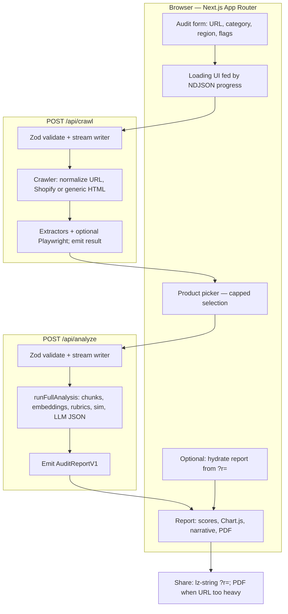

# AI Product Shelf Audit

Stateless Next.js (App Router) app that estimates **AI commerce visibility** for public Shopify / DTC storefronts: catalog crawl, offline embeddings (`text-embedding-3-small`), deterministic readiness rubrics, and **retrieval-style** simulation (not live ChatGPT / web search).

## Requirements

- Node 20+
- `OPENAI_API_KEY` for `/api/analyze` (embeddings + structured JSON narrative)

## Local development

```bash
yarn install
yarn dev
```

Open [http://localhost:3000](http://localhost:3000), then **Start an audit** → `/audit`.

### Playwright / Chromium (optional, for non-Shopify or rendered HTML)

For local headless rendering, install browsers once:

```bash
npx playwright install chromium
```

On **Vercel**, the crawler uses `@sparticuz/chromium` with `playwright-core` (see `next.config.ts` `serverExternalPackages`).

## Environment variables

| Variable | Required | Description |
|----------|----------|-------------|
| `OPENAI_API_KEY` | Yes (for analysis) | OpenAI API key |
| `OPENAI_MODEL` | No | Chat model for narrative sections (default `gpt-4o-mini`) |
| `OPENAI_EMBEDDING_MODEL` | No | Embeddings model (default `text-embedding-3-small`) |
| `MAX_PRODUCTS` | No | Cap on products pulled from `products.json` (default 75, max 200) |

## Vercel

- Deploy as a standard Next.js project.
- Set `OPENAI_API_KEY` in project settings.
- Long-running routes: `/api/crawl` and `/api/analyze` use `maxDuration` in each route file (e.g. analyze may allow longer runs for embeddings + web research). Increase if your Vercel plan allows.
- Runtime logs: server errors are written as structured JSON via `logServerError` in `lib/errors/server.ts`.

## How it works (technical overview)

End-to-end flow: the browser drives two streaming API routes; everything else is in-memory on the server for that request (no database).

### Streaming responses (not an immediate full body)

**`/api/crawl`** and **`/api/analyze`** do **not** return one complete JSON document as soon as the request is accepted. Each route responds with an HTTP **200** whose **body is a stream** of **NDJSON** (one JSON object per line, `Content-Type: application/x-ndjson` with `Cache-Control: no-store`). While work runs, the server emits many **`progress`** lines (`phase`, `percent`, `message`); when finished, it sends either **`error`** (code) or a final **`result`** line with **`CrawlResult`** / **`AuditReportV1`**. The client reads the stream incrementally (`lib/stream/read-ndjson`), so the loading UI updates during long crawls and analysis—**expect progress first, full payload last.**



### Browser — Next.js App Router

`AuditClient` orchestrates steps (form → pick → report), reads **NDJSON** incrementally (`lib/stream/read-ndjson`), and surfaces phases in the loading UI. MUI handles layout and feedback; **Chart.js** (`react-chartjs-2`) renders breakdown and simulation charts in the report.

### Route: `/api/crawl`

Validates JSON with **Zod**, runs the crawl in a **ReadableStream**, and emits newline-delimited JSON: progress objects for UX, then either an error code or a typed **`CrawlResult`** (`lib/types/crawl`).

### `lib/crawler`

Resolves the storefront, prefers **Shopify** `products.json` when available, otherwise discovers product URLs from HTML and enriches a bounded subset with fetched pages. **Cheerio** parses static HTML; **Playwright** (or `playwright-core` + bundled Chromium on Vercel) is used when rendered content is needed. Output is normalized product records (title, URLs, evidence snippets) for the primary store and any competitor origins you passed in.

### Route: `/api/analyze`

Requires `OPENAI_API_KEY`. Accepts the crawl payload plus selected product IDs and merchandising hints, streams the same NDJSON pattern, and ends with **`AuditReportV1`** (`lib/types/report`, Zod at the boundary).

### `lib/analysis`

Turns catalog text into **chunks**, calls **OpenAI embeddings** (`text-embedding-3-small` by default), and scores alignment to **discovery prompts** (curated / regional) via cosine similarity—this powers the “live shelf” style bars without calling ChatGPT in real time. **Rubrics** add deterministic checklist-style dimensions. Optional **market brand** lines are model-suggested names for each prompt (general knowledge, not web search or your crawl). Finally **`llm-report`** asks the chat model for **JSON-only** sections grounded in the computed signals (not a second crawl).

### Sharing

Successful reports can be serialized with **`lz-string`** into `?r=` (`lib/share/report-codec`). If the payload is too large for a comfortable URL, users rely on **PDF export** from the same report object.